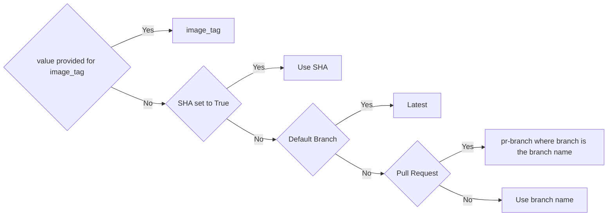

# Docker Build - Tag - Publish

This GitHub Action will build, tag, and publish your docker image.  The logic has been designed for our use case, but can be modifed for yours.

The image name will default to be the same as the GitHub Repo.  

# Default Tagging Logic
The tagging logic works as follows:
1. If you have a value for `image_tag` then we will use that value.
2. If you set `sha` to `true` then we will tak with the SHA
3. If this is the default branch, then the tag will be `latest`
4. if this is a pull request, the the tag will be `pr-branch` where branch is the branch name.
5. Otherwise, we'll use the branch name or tag value.



### Inputs

The following can be used as `step.with` keys.  T/F types expect true or false.  Req is required.

| Name             | Type    | Req | Description                  | Default |
|------------------|---------|-----|------------------------------|---------|
| `docker_username` | string | Yes | Dockerhub username | N/A |
| `docker_password` | string | Yes | Dockerhub Password | N/A |
| `checkout` | T/F | No | Determines if we should chckout the repository.  Set to `false` if this is being done in an eariler step | `true` |
| `image_tag` | string | No | Use this tag instead of the tagging logic.  | See tagging logic |
| `use_latest` | T/F | No | The default branch gets a latest tag | `true` |
| `sha` | T/F | No | Set to `true` to use the SHA for the tag. | `false` |
| `org_name` | string | No | Docker org name.   | GitHub Org Name |
| `repo_name` | string | No | The name of the Docker Repository.  | GitHub repo name. |


## Example 1

This will checkout the code, build, tag and push using the default tags. 

```yaml
-   id: docker-publish
    uses: bitovi/github-actions-docker-publish@1
      with:
        docker_username: ${{ secrets.DOCKERHUB_USERNAME }}
        docker_password: ${{ secrets.DOCKERHUB_PASSWORD }}
```

## Example 2

Here we check the code out since we make a change before the build / publish step.  We also show how to get the image and tag for later use in the same job.

```yaml
  steps:
    - name: Checkout 
      uses: actions/checkout@v3
    - name: do something to the code
      run: echo "Changed code" > text.txt
    - id: docker-publish
      name: Build image
      uses: bitovi/github-actions-docker-publish@1.0.0
      with:
        docker_username: ${{ secrets.DOCKERHUB_USERNAME }}
        docker_password: ${{ secrets.DOCKERHUB_PASSWORD }}
        checkout: 'false'
        image_tag: it
        sha: 'true' # won't do anything since image_tag is set
        org_name: bitovi
        repo_name: deploy-eks-helm
    - run: |
        echo "Image Created:  ${{ env.image }}"
        echo "Tag Created: ${{ env.tag }}"
```

## License
The scripts and documentation in this project are released under the [MIT License](https://github.com/bitovi/github-actions-docker-publish/blob/main/LICENSE).

## Provided by Bitovi
[Bitovi](https://www.bitovi.com/) is a proud supporter of Open Source software.

## Customize
Please feel free to copy and customize this action for your specific use case, just give some credit to Bitovi as the orignal authors.  

## Need help?
Bitovi has consultants that can help.  Drop into [Bitovi's Community Slack](https://www.bitovi.com/community/slack), and talk to us in the `#devops` channel!

Need DevOps Consulting Services?  Head over to https://www.bitovi.com/devops-consulting, and book a free consultation.
